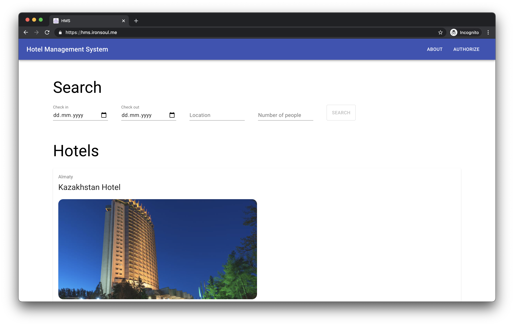

<!--
*** Thanks for checking out the Best-README-Template. If you have a suggestion
*** that would make this better, please fork the repo and create a pull request
*** or simply open an issue with the tag "enhancement".
*** Thanks again! Now go create something AMAZING! :D
-->


<!-- PROJECT SHIELDS -->
<!--
*** I'm using markdown "reference style" links for readability.
*** Reference links are enclosed in brackets [ ] instead of parentheses ( ).
*** See the bottom of this document for the declaration of the reference variables
*** for contributors-url, forks-url, etc. This is an optional, concise syntax you may use.
*** https://www.markdownguide.org/basic-syntax/#reference-style-links
-->


<!-- PROJECT LOGO -->
<br />
<p align="center">


<h3 align="center">Hotel Management System</h3>

  <p align="center">
    Full-stack website implemented using Spring Boot and React.js
    <br />
    <br />
    <a href="https://hms.ironsoul.me">View Demo</a>
    ·
    <a href="https://github.com/ironsoul0/hotel-management/issues">Report Bug</a>
    ·
    <a href="https://github.com/ironsoul0/hotel-management/issues">Request Feature</a>
  </p>
</p>


<!-- ABOUT THE PROJECT -->
## About The Project



This website is a final project we made for our Software Engineering class at Nazarbayev University. 

The project implements a Hotel Management System where guests can book hotel rooms, desk clerks can approve reservations and managers can control hotel employees (for example, working hours of desk clerks).

Our app supports different roles and displays content accordingly. There are currently three roles available: Guest, Manager and Desk Clerk.

In order to get access to the admin panel, you have to log in as a manager or desk clerk via this [VPN access link](https://hms.ironsoul.me/vpn-access). For the sake of simplicity, this URL is publicly available but in the real project, it should be accessible only through VPN. 

### Built With

* [Java Spring Boot](https://spring.io/projects/spring-boot)
* [React.js](https://reactjs.org/)
* [Redux Toolkit](https://redux-toolkit.js.org/)
* [Material UI](https://material-ui.com/)
* [MySQL](https://www.mysql.com/)


<!-- GETTING STARTED -->
## Getting Started

If you want to start the project locally.

### Prerequisites

Here are things you want to have on your computer beforehand.

* MySQL
* Java SDK
* mvn
* Node.js

### Installation

1. Clone the repo
   ```sh
   git clone https://github.com/ironsoul0/hotel-management
   ```
2. Run using mvn
   ```sh
   mvn clean spring-boot:run
   ```
3. Install dependencies for a client and start it
   ```sh
   cd client; npm install; npm start
   ```


## Brought to you by Frogs 🐸
* [Sherkhan Azimov](https://github.com/AzimovS)
* [Danel Batyrbek](https://github.com/ktlthebest)
* [Rustem Turtayev](https://github.com/rustem17)
* [Temirzhan Yussupov](https://github.com/ironsoul0)


